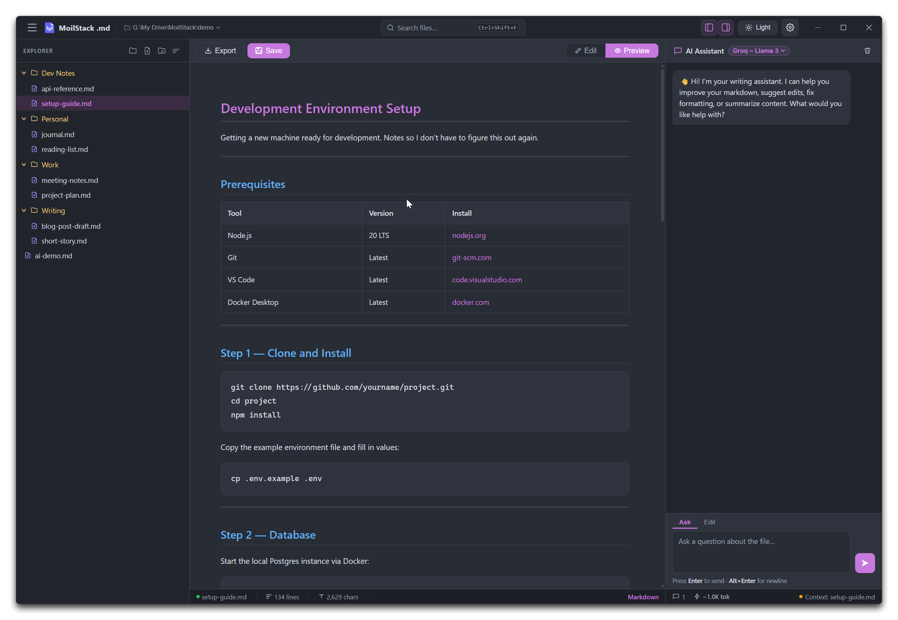

# MoilStack .md (markdown) — Privacy-First Markdown AI Editor & Viewer

[](https://github.com/moilstack/moilstack-md/releases)
-blue)


An open-source desktop **Markdown AI editor** and standalone markdown viewer built with Electron. Write, edit, and view Markdown files with syntax highlighting, live split-pane preview, and an integrated local AI assistant — all running privately on your machine.


## Download

Pre-built installers are available on the [Releases page](https://github.com/moilstack/moilstack-md/releases/latest).

| Platform | Format |
|---|---|
| Windows | NSIS installer, portable ZIP |
| Linux | AppImage, DEB |
| macOS | DMG, ZIP (coming soon) |

## Features

- **Dual-pane editor** — syntax-highlighted editor with Markdown preview (`Ctrl+\`` to toggle)
- **File explorer** — browse, create, rename, and open `.md` files from a folder, with Multi-level, Root-only, and Custom (no-folder) sidebar modes
- **Global search** — find filenames and in-file content across the open folder (`Ctrl+Shift+F`), with tag search via `#tag` or `tag:name`
- **AI Assistant** — ask the AI to edit your document, answer questions, or improve your writing
- **Smart AI editing** — document edits are applied silently and instantly; informational answers stream as chat
- **Undo AI edits** — every AI document change is reversible with the Undo button or `Ctrl+Z`
- **Visual table builder** — insert Markdown tables with a point-and-click grid editor
- **File labels & tags** — colour-tag files in the explorer for quick navigation, or add searchable tags stored in YAML frontmatter
- **File backups** — automatic snapshots to the app's user data folder before every AI edit
- **File trash** — delete files to the OS Recycle Bin from the context menu
- **Multi-model support** — connect any OpenAI-compatible API (Groq, OpenAI, Mistral, Together AI) or run Ollama locally
- **Export to PDF** — one-click export via native save dialog
- **Dark / light theme** — persisted across sessions
- **Configurable editor** — font size and font family settings

## Screens



## Getting Started

### Prerequisites

- [Node.js](https://nodejs.org/) v18 or later
- [npm](https://www.npmjs.com/)

### Install & Run

```bash
git clone https://github.com/moilstack/moilstack-md.git
cd moilstack-md
npm install
npm start
```

> `npm start` uses `nodemon` — the app auto-reloads when you change any file in `src/`.

### Build for Distribution

```bash
npm run package
```

Output goes to the `dist/` folder. Targets: NSIS/ZIP (Windows), DMG/ZIP (macOS), AppImage/DEB (Linux).


## Installing on Linux

**DEB** (Debian, Ubuntu, Mint, Pop!_OS, and other Debian-based distros):

```bash
sudo apt install ./moilstack-md_*.deb
```

**AppImage** (works on virtually any distro — Fedora, Arch, openSUSE, Ubuntu, etc. — no installation required):

```bash
chmod +x moilstack-md-*.AppImage
./moilstack-md-*.AppImage
```

If it fails to launch with a FUSE-related error (some minimal or newer distros, e.g. Fedora 41+, ship without FUSE2 by default), either install FUSE:

```bash
# Fedora
sudo dnf install fuse fuse-libs
# Ubuntu/Debian
sudo apt install fuse
```

or skip FUSE entirely and extract-and-run instead:

```bash
./moilstack-md-*.AppImage --appimage-extract-and-run
```

## AI Assistant Setup

MoilStack .md relies on the standard OpenAI Chat Completions API architectural design, allowing you to instantly deploy powerful cloud models or execute complex workflows completely offline.

### Flexible Deployment Options
* **Fully Offline & Private:** Protect sensitive information by running local text operations straight on your machine through **Ollama**.
* **High-Speed Cloud API Infrastructure:** Connect native accounts from **Google Gemini**, **Groq**, **OpenAI**, **Mistral**, or **Together AI**.

For definitive step-by-step setup guides, free tier account endpoint links, local model terminal scripts, and detailed performance matrices, see our dedicated [AI Configuration & Model Setup Guide](AI_SETUP.md).


## Using the AI Assistant

MoilStack .md acts as an interactive markdown AI editor, allowing you to seamlessly communicate text changes directly to your local workspace.

### Document Editing & Refinement
Simply ask the AI assistant to modify your active file text:
* "Fix the grammar and layout flow in this document"
* "Add a clean summary section right at the top"
* "Convert this raw text paragraph into a clear bulleted list"

When the AI assistant processes an edit, changes are applied silently and instantly into the editor pane. A structural summary of the modifications appears inside the chat window.

### Safety & Version Controls
* **Instant Undo:** Every single document modification made by the AI can be instantly reversed using the UI Undo button (↺) or by pressing `Ctrl+Z`.
* **Automatic Snapshots:** For absolute safety, MoilStack .md saves automatic file backups to the app's user data directory (not your workspace folder) before any AI processing occurs.
* **Scoped Selections:** Highlight specific sentences or code lines inside the editor pane before typing a prompt to limit the AI assistant's scope exclusively to that text selection.


## Keyboard Shortcuts

| Shortcut | Action |
|---|---|
| `Ctrl+S` | Save file |
| `Ctrl+Z` | Undo (AI edits first, then native undo) |
| `Ctrl+\`` | Toggle Edit / Preview mode |
| `Ctrl+O` | Open folder picker |
| `Ctrl+N` | New untitled file (in-memory) |
| `Ctrl+Shift+N` | New file on disk in Explorer's active folder |
| `Ctrl+F` | Find & replace |
| `Ctrl+Shift+F` | Global search (filenames & content) |
| `Enter` | Send chat message |
| `Alt+Enter` | New line in chat input |
| `Escape` | Close any open modal or dropdown |

## File Backups

Every time the AI edits your document, MoilStack .md saves a backup to the app's user data directory, keyed to your file's parent folder — not inside your workspace:

```
<app userData>/backups/<folder-name>-<folder-hash>/
```

On Windows this is typically under `%APPDATA%`, on macOS under `~/Library/Application Support`, and on Linux under `~/.config`.

Files are named `<filename>_<timestamp>.md` and the last **10 backups per file** are kept automatically. Use these to recover from any unwanted AI changes.


## Contributing

Issues and pull requests are welcome. For significant changes, please open an issue first to discuss what you'd like to change.

See [CHANGELOG.md](CHANGELOG.md) for version history.

## License

MIT — see [LICENSE](LICENSE) for details.

> The project name, logo, and visual branding assets are not open source. See [BRANDING.md](BRANDING.md) for the Trademark & Branding Policy.
