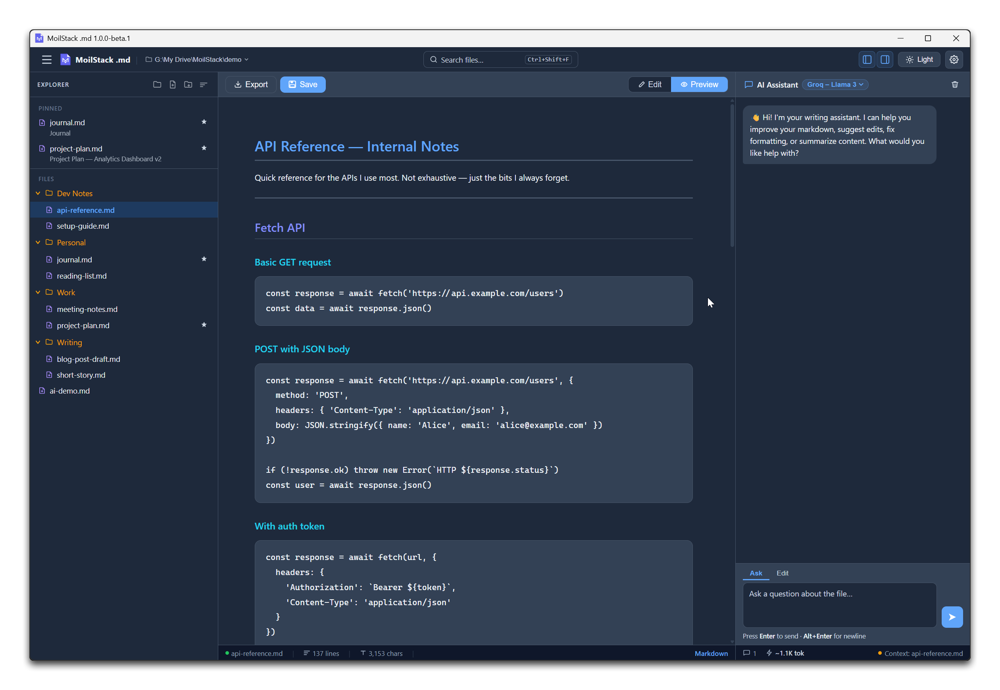
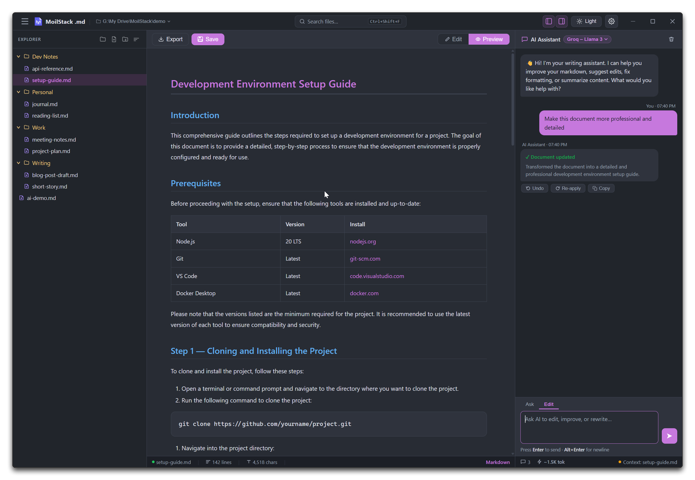
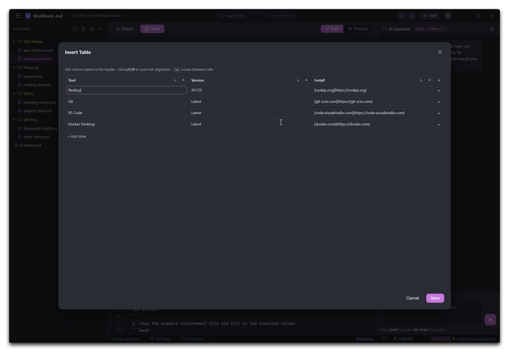

# MoilStack .md

[](https://github.com/moilstack/moilstack-md/releases)


A desktop Markdown editor with an integrated AI assistant, built with Electron.  
Write and edit Markdown files with syntax highlighting, preview, and AI-powered editing — all running locally on your machine.

---



## Download

Pre-built installers are available on the [Releases page](https://github.com/moilstack/moilstack-md/releases/latest).

| Platform | Format |
|---|---|
| Windows | NSIS installer, portable ZIP |

---

## Features

- **Dual-pane editor** — syntax-highlighted editor with live Markdown preview (`Ctrl+\`` to toggle)
- **File explorer** — browse, create, rename, and open `.md` files from a folder
- **AI Assistant** — ask the AI to edit your document, answer questions, or improve your writing
- **Smart AI editing** — document edits are applied silently and instantly; informational answers stream as chat
- **Undo AI edits** — every AI document change is reversible with the Undo button or `Ctrl+Z`
- **Visual table builder** — insert Markdown tables with a point-and-click grid editor
- **File labels** — colour-tag files in the explorer for quick navigation
- **File backups** — automatic `.markflow/backups/` snapshots before every AI edit
- **Multi-model support** — connect any OpenAI-compatible API (Groq, OpenAI, Mistral, Together AI) or run Ollama locally
- **Export to PDF** — one-click export via native save dialog
- **Dark / light theme** — persisted across sessions
- **Configurable editor** — font size and font family settings

---





## Getting Started

### Prerequisites

- [Node.js](https://nodejs.org/) v18 or later
- [npm](https://www.npmjs.com/)

### Install & Run

```bash
git clone https://github.com/moilstack/moilstack-md.git
cd moilstack-md
npm install
npm start
```

> `npm start` uses `nodemon` — the app auto-reloads when you change any file in `src/`.

### Build for Distribution

```bash
npm run package
```

Output goes to the `dist/` folder. Targets: NSIS/ZIP (Windows), DMG/ZIP (macOS), AppImage/DEB (Linux).

---

## AI Assistant Setup

Open **Settings** (⚙ gear icon) → **AI Models** → **Add Model** and choose a provider type.

### Cloud API

Any OpenAI-compatible provider works. Enter the Base URL, your API key, and a model name, then save.

| Provider | Base URL | Free? |
|---|---|---|
| [Groq](https://console.groq.com) | `https://api.groq.com/openai/v1` | ✅ No credit card |
| [Google Gemini](https://aistudio.google.com/app/apikey) | `https://generativelanguage.googleapis.com/v1beta/openai/` | ✅ Free tier |
| [OpenRouter](https://openrouter.ai/keys) | `https://openrouter.ai/api/v1` | ✅ Free models (append `:free`) |
| [Mistral](https://console.mistral.ai) | `https://api.mistral.ai/v1` | ✅ Free tier |
| [Together AI](https://api.together.ai) | `https://api.together.xyz/v1` | ✅ $1 credit on signup |
| [OpenAI](https://platform.openai.com/api-keys) | `https://api.openai.com/v1` | Paid |

### Ollama (local, fully private)

1. Install from [ollama.com/download](https://ollama.com/download)
2. Pull a model: `ollama pull qwen2.5:7b` (recommended) or `ollama pull llama3.2`
3. In Settings, add a model with type **Ollama** and click **Detect** to find running models

> Models below 7B parameters may not follow the document editing format reliably.

### Recommended models

| Model | Provider | Doc Editing | Speed |
|---|---|---|---|
| `llama-3.3-70b-versatile` | Groq (free) | ⭐⭐⭐⭐⭐ | Fast |
| `gemini-2.0-flash` | Google (free) | ⭐⭐⭐⭐⭐ | Very fast |
| `gpt-4o-mini` | OpenAI (paid) | ⭐⭐⭐⭐⭐ | Fast |
| `qwen2.5:7b` | Ollama | ⭐⭐⭐⭐ | Medium |
| `llama3.2` | Ollama | ⭐⭐⭐ | Fast |

---

## Using the AI Assistant

### Chat basics

- Type a prompt in the chat panel on the right and press **Enter** (or click the send button)
- Use **Alt+Enter** to insert a newline in your prompt

### Document editing

Ask the AI to modify your document:

```
Fix the grammar in this document
Add a summary section at the top
Convert this to use bullet points
Make the introduction more concise
```

When the AI makes a document edit:
- Changes are **applied silently and instantly** — no streaming wall of text
- A summary of what changed appears in the chat bubble
- Use the **Undo** button (↺) on the bubble to revert, or press `Ctrl+Z`
- Use the **Re-apply** button (↻) to reapply the last undone edit
- A backup is saved to `.markflow/backups/` before every AI edit

### Informational questions

Ask anything about writing, Markdown, or your document:

```
What's the difference between a blockquote and a code block?
How do I create a table in Markdown?
Summarise what this document is about
```

Answers stream directly into the chat.

### Line selection

Select lines in the editor before sending a prompt to scope the AI's edit to just those lines.

---

## Keyboard Shortcuts

| Shortcut | Action |
|---|---|
| `Ctrl+S` | Save file |
| `Ctrl+Z` | Undo (AI edits first, then native undo) |
| `Ctrl+\`` | Toggle Edit / Preview mode |
| `Ctrl+O` | Open folder picker |
| `Ctrl+N` | New file in current folder |
| `Ctrl+F` | Find & replace |
| `Enter` | Send chat message |
| `Alt+Enter` | New line in chat input |
| `Escape` | Close any open modal or dropdown |

---

## File Backups

Every time the AI edits your document, MoilStack .md saves a backup to:

```
<your-folder>/.markflow/backups/
```

Files are named `<filename>_<timestamp>.md` and the last **10 backups per file** are kept automatically. Use these to recover from any unwanted AI changes.

---

## Provider Compatibility

MoilStack .md uses the **OpenAI Chat Completions API format** for all API-type models. Any provider that offers an OpenAI-compatible endpoint works out of the box.

| Provider | Compatible? | Notes |
|---|---|---|
| Groq | ✅ | Fully compatible, free tier |
| OpenAI | ✅ | Fully compatible |
| Together AI | ✅ | Fully compatible |
| Mistral AI | ✅ | Fully compatible |
| OpenRouter | ✅ | Fully compatible |
| Google Gemini | ✅ | Via OpenAI-compatible endpoint |
| Cerebras | ✅ | Fully compatible |
| Perplexity | ✅ | Fully compatible |
| Azure OpenAI | ⚠️ | Different URL structure — use the deployment-specific endpoint |
| Anthropic Claude | ❌ | Different API format — not yet supported |
| AWS Bedrock | ❌ | Requires AWS SigV4 signing — not yet supported |
| Ollama | ✅ | Via built-in Ollama type (NDJSON streaming) |

---

## Project Structure

```
moilstack-md/
├── src/
│   ├── main/
│   │   ├── index.js              # Electron main process, window management
│   │   └── ipc.js                # IPC handlers (file I/O, AI requests, config)
│   ├── preload/
│   │   └── index.js              # Context bridge (safe API exposure to renderer)
│   ├── assets/
│   │   ├── icon.png              # App icon
│   │   └── file-icon-md.svg      # .md file association icon
│   └── renderer/
│       ├── index.html            # App shell
│       ├── index.js              # Main renderer entry point
│       ├── styles.css            # All styles
│       ├── aiConfig.js           # AI model settings UI
│       ├── aiService.js          # AI request dispatcher
│       ├── chatPanel.js          # AI chat panel
│       ├── editorCore.js         # Editor logic, undo, ruler
│       ├── fileTreeManager.js    # File explorer tree rendering
│       ├── fileOperations.js     # Create, rename, delete files/folders
│       ├── markdownRenderer.js   # Markdown → HTML preview
│       ├── saveManager.js        # Save / dirty-state tracking
│       ├── storageManager.js     # localStorage / IPC persistence
│       ├── tableBuilder.js       # Visual table builder modal
│       ├── exportService.js      # PDF export
│       └── themeManager.js       # Dark / light theme
├── build/
│   ├── installer.nsh             # NSIS installer customisation
│   └── make-file-icon.js         # Icon generation script
├── assets/                       # Screenshots and marketing assets (add here)
├── CHANGELOG.md
├── package.json
└── README.md
```

---

## Contributing

Issues and pull requests are welcome. For significant changes, please open an issue first to discuss what you'd like to change.

See [CHANGELOG.md](CHANGELOG.md) for version history.

## License

MIT — see [LICENSE](LICENSE) for details.

> The project name, logo, and visual branding assets are not open source. See [BRANDING.md](BRANDING.md) for the Trademark & Branding Policy.
