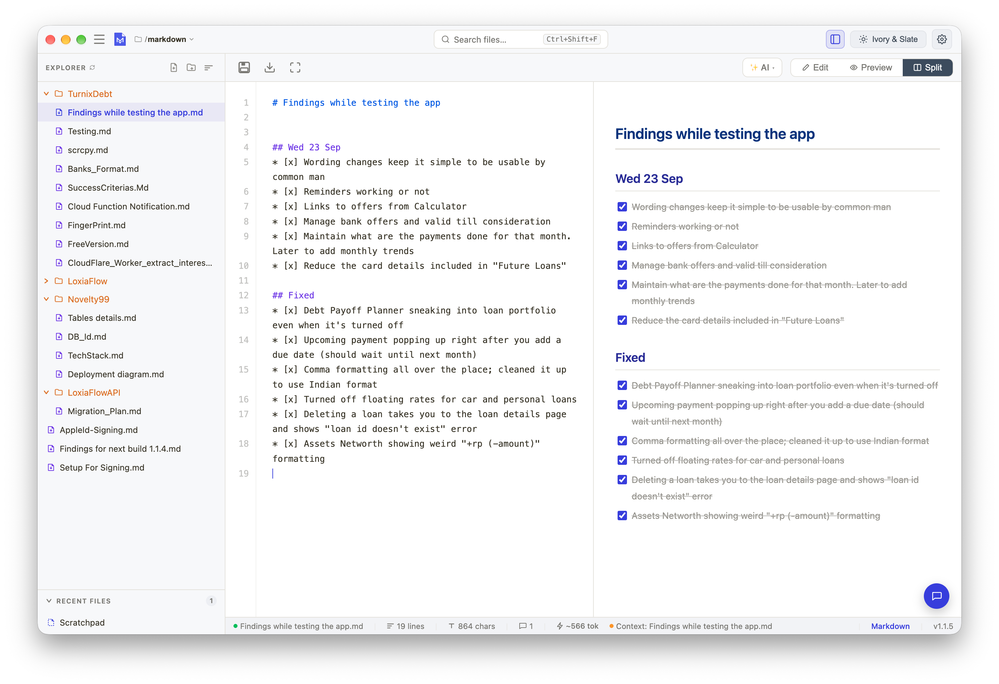
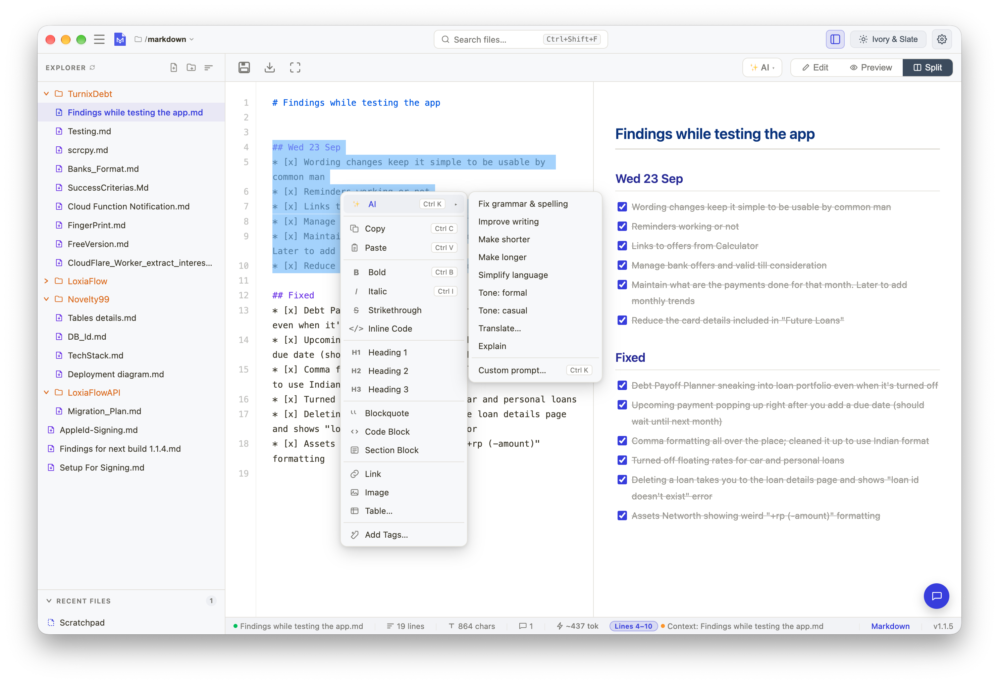
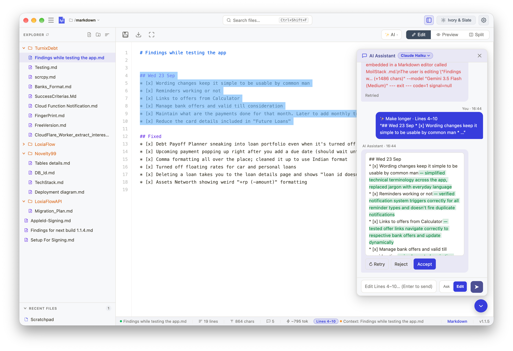

# MoilStack .md (markdown) — AI-Powered Markdown Editor with Version History

An open-source desktop **Markdown AI editor** and standalone markdown viewer built with Electron. Write, edit, and view Markdown files with syntax highlighting, a live preview pane, and an integrated AI assistant — with the option to run everything privately on your machine.

## Download

Get the latest installer for Windows, macOS, or Linux from the [Releases page](https://github.com/moilstack/moilstack-md/releases/latest), or from the [Microsoft Store](https://apps.microsoft.com/detail/9pp0mrt5lrk5?hl=en-US&gl=AZ).

Windows SmartScreen warning or Linux launch issues? See the [Install Guide](INSTALL.md).

## Features

**Writing**
- **Edit, Preview and Split modes** — syntax-highlighted editor with live preview
- **Quick edit in Preview** — double-click a block to edit it in place
- **Visual table builder** — create Markdown tables with a point-and-click grid
- **Export to PDF**, dark / light themes, and configurable editor fonts

**AI**
- **✨ AI actions** — right-click selected text to fix grammar, improve, shorten, translate and more; use the toolbar ✨ AI button to summarize, add a table of contents, proofread, or suggest tags
- **Review before applying** — see changes highlighted, then Accept, Reject or Retry
- **AI Assistant chat** — ask questions about your document or request any other change
- **Any model** — OpenAI-compatible APIs (Groq, Gemini, OpenAI, Mistral…), Anthropic, Ollama (fully offline), or CLI tools like Claude Code

**Files**
- **File explorer** — Multi-level tree, Root-only, or Recent-only modes
- **Search** — across file names and content, with `#tag` search
- **Labels & tags** — colour-label files and add searchable frontmatter tags
- **Version History** — every save is backed up; browse and restore old versions
- **Safe by default** — every AI change can be undone with `Ctrl+Z`

## Screens

### ✨ AI actions on selected text

### Review AI changes before applying

## Documentation

### Installing
Installers are available for Windows (NSIS, portable ZIP, Microsoft Store), macOS (DMG, ZIP) and Linux (DEB, AppImage). The guide explains how to get past the Windows SmartScreen warning and how to fix AppImage launch errors on newer Linux distros.

→ [Install Guide](INSTALL.md)

### Connecting an AI model
MoilStack .md works with OpenAI-compatible APIs (Groq, Gemini, OpenAI, Mistral, Together AI), Anthropic's API, Ollama running locally or in the cloud, and installed CLI tools like Claude Code. A few starter models are added on first launch — just add an API key or log in to the CLI. Use Ollama to keep everything fully offline.

→ [AI Setup Guide](AI_SETUP.md)

### Using the app
Learn how to use the ✨ AI actions on selected text and whole documents, review and accept AI changes, chat with the AI Assistant, restore old versions of a file, and speed things up with keyboard shortcuts.

→ [User Guide](USER_GUIDE.md)

### Contributing
Issues and pull requests are welcome. The guide covers running the app from source, running tests, and building installers.

→ [Contributing Guide](CONTRIBUTING.md)

See the [Changelog](CHANGELOG.md) for what's new in each version.

## License

MIT — see [LICENSE](LICENSE). The project name, logo, and branding are not open source — see [BRANDING.md](BRANDING.md).
